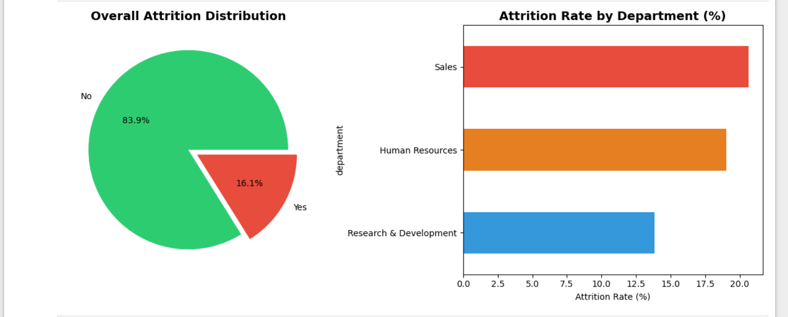
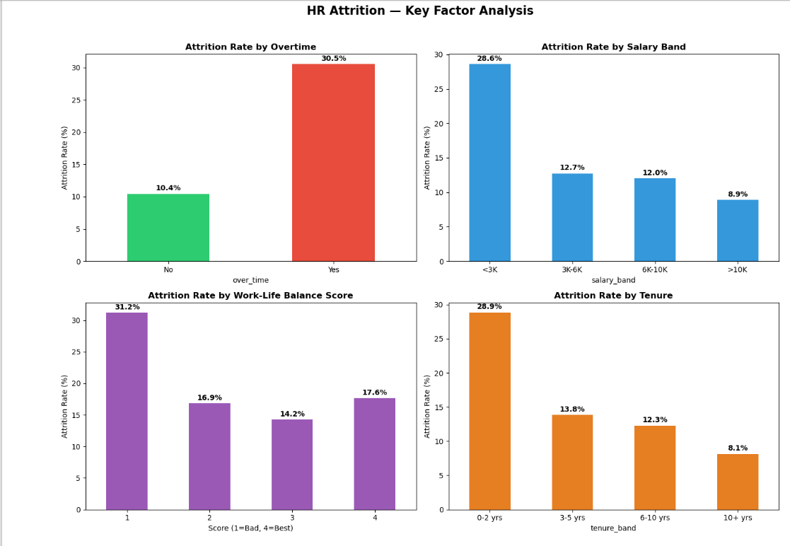
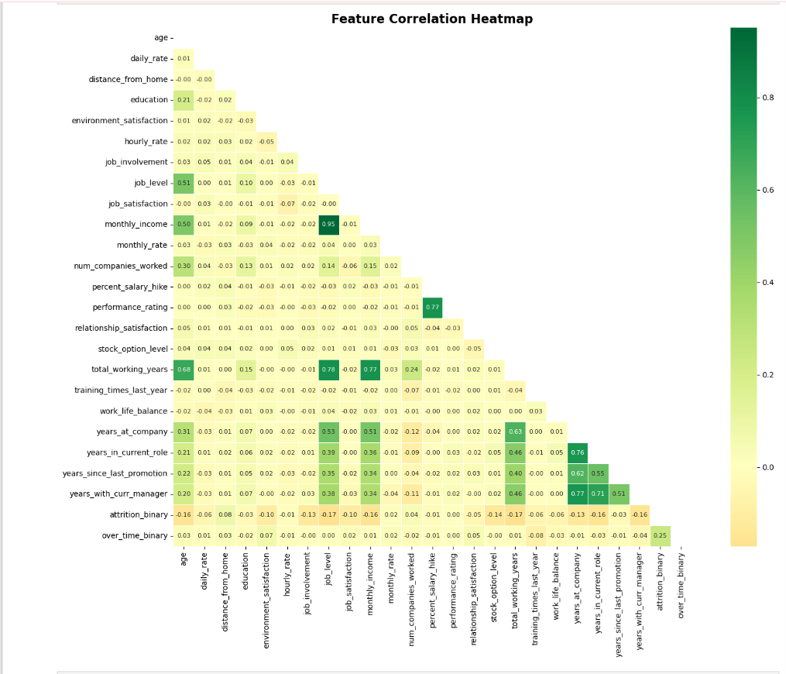
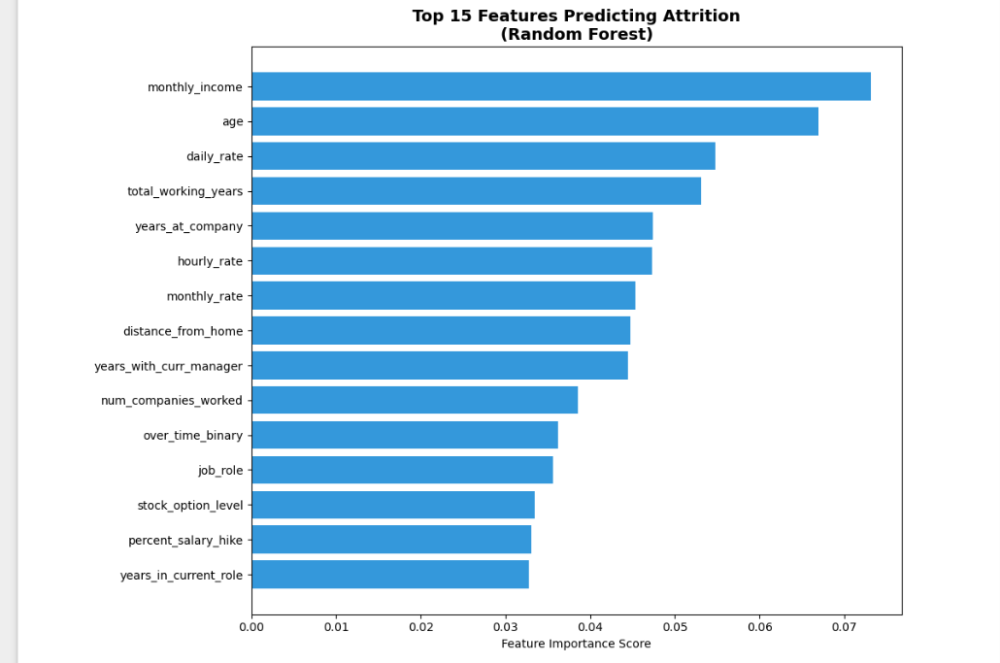

# 👥 HR Attrition Analysis — End-to-End Data Science Project

## 📌 Project Overview
An end-to-end Data Science project analyzing employee attrition using the IBM HR Analytics 
dataset (1,470 employees). The project combines SQL-based exploration, Python EDA, 
and a Random Forest classification model to identify key attrition drivers and 
predict at-risk employees.

**Tools Used:** PostgreSQL · Python (pandas, seaborn, scikit-learn) · Jupyter Notebook · Power BI

---

## 🎯 Problem Statement
Employee attrition costs companies 6-9 months of an employee's salary in replacement costs. 
This project answers: **What factors drive attrition, and can we predict which employees 
are likely to leave?**

---

## 🔍 Key Findings

| Factor | Finding |
|---|---|
| Overall Attrition Rate | **16.12%** — above 10-15% industry benchmark |
| Highest Risk Department | **Sales (20.63%)** |
| Highest Risk Job Role | **Sales Representative (39.76%)** |
| Overtime Impact | Overtime employees **3x more likely** to leave (30.5% vs 10.4%) |
| Salary Impact | Low earners (<$3K) have **28.6% attrition** vs 8.9% for high earners |
| Early Tenure Risk | Employees with 0-2 years have **29.82% attrition** |
| Work-Life Balance | Score 1 (worst) = **31.25% attrition** vs 14.22% for score 3 |

---

## 🤖 Machine Learning Model

| Metric | Value |
|---|---|
| Algorithm | Random Forest Classifier |
| Accuracy | **84.01%** |
| Training Split | 80/20 (stratified) |
| Class Balancing | class_weight='balanced' |

**Top 5 Features Predicting Attrition:**
1. `monthly_income` — #1 predictor
2. `age`
3. `total_working_years`
4. `years_at_company`
5. `over_time`

---

## 📊 Visualizations

### Attrition Distribution & Department Analysis

### Key Factor Analysis

### Feature Correlation Heatmap

### Top 15 Features — Random Forest

---

## 🗂️ Project Structure

---

## 🛠️ Tech Stack
- **Database**: PostgreSQL 17 + pgAdmin 4
- **Language**: Python 3.12, SQL
- **Libraries**: pandas, numpy, matplotlib, seaborn, scikit-learn, psycopg2
- **ML Model**: Random Forest Classifier (scikit-learn)
- **Dataset**: [IBM HR Analytics Employee Attrition](https://www.kaggle.com/datasets/pavansubhasht/ibm-hr-analytics-attrition-dataset)

---

## 🚀 How to Reproduce
1. Download dataset from [Kaggle](https://www.kaggle.com/datasets/pavansubhasht/ibm-hr-analytics-attrition-dataset)
2. Create PostgreSQL database: `hr_analytics_db`
3. Run `sql/01_schema.sql` to create the table
4. Import the CSV into `hr_employee` table
5. Run SQL files `02-06` for exploratory analysis
6. Open `notebooks/Hr_Analytics.ipynb` in Jupyter
7. Update the database connection in Cell 1 with your credentials
8. Run all cells

---

## 💡 Business Recommendations
1. **Reduce mandatory overtime** — single biggest policy change; 
   could reduce attrition by up to 3x for affected employees
2. **Review Sales Representative compensation** — 39.76% attrition 
   is unsustainable; targeted salary review for this role is critical
3. **Structured onboarding program** — 29.82% of 0-2 year employees 
   leave; a 90-day + 1-year mentorship program would directly address this
4. **Salary benchmarking for <$3K band** — 28.6% attrition suggests 
   compensation isn't competitive at lower levels
5. **Work-life balance initiatives** — employees scoring 1 on WLB 
   have 2x the attrition of those scoring 3; flexible work policies 
   would have measurable retention impact

---

## 📝 Resume Bullet Points
- Built end-to-end HR attrition analysis using PostgreSQL, Python, and 
  Power BI on IBM HR dataset (1,470 records, 35 features)
- Developed Random Forest model achieving **84% accuracy** in predicting 
  employee attrition risk
- Identified overtime as strongest behavioral predictor — employees working 
  overtime **3x more likely to leave**
- Discovered monthly income as #1 ML feature; low earners (<$3K) show 
  **28.6% attrition rate** vs 8.9% for high earners
